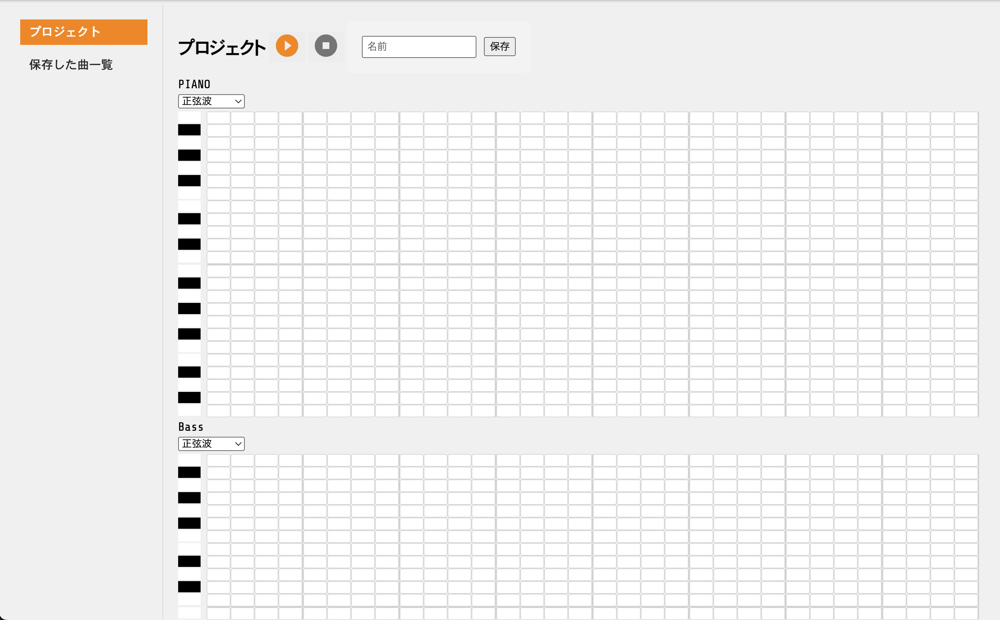
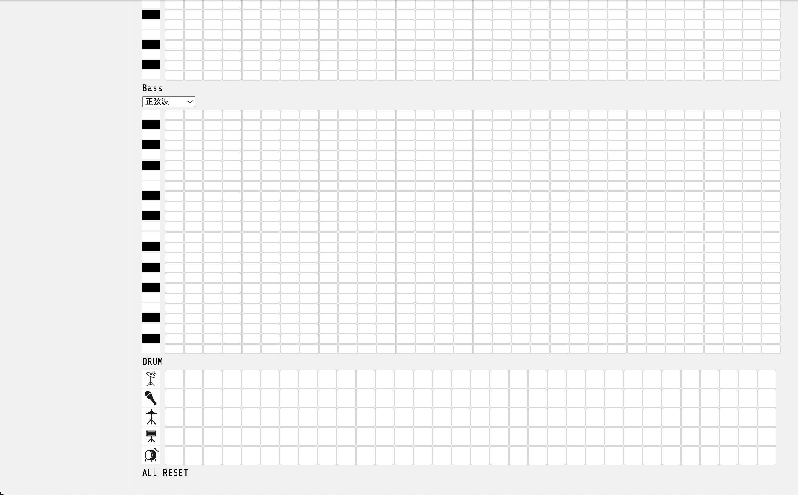
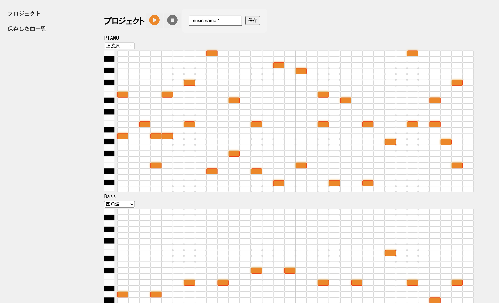
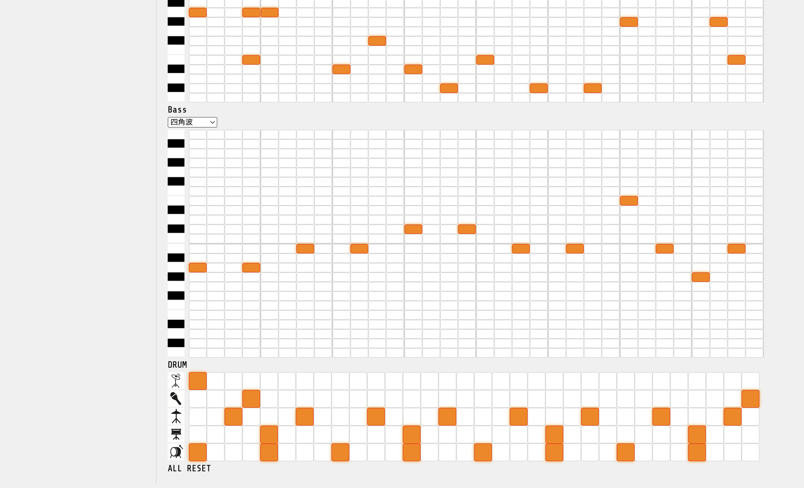
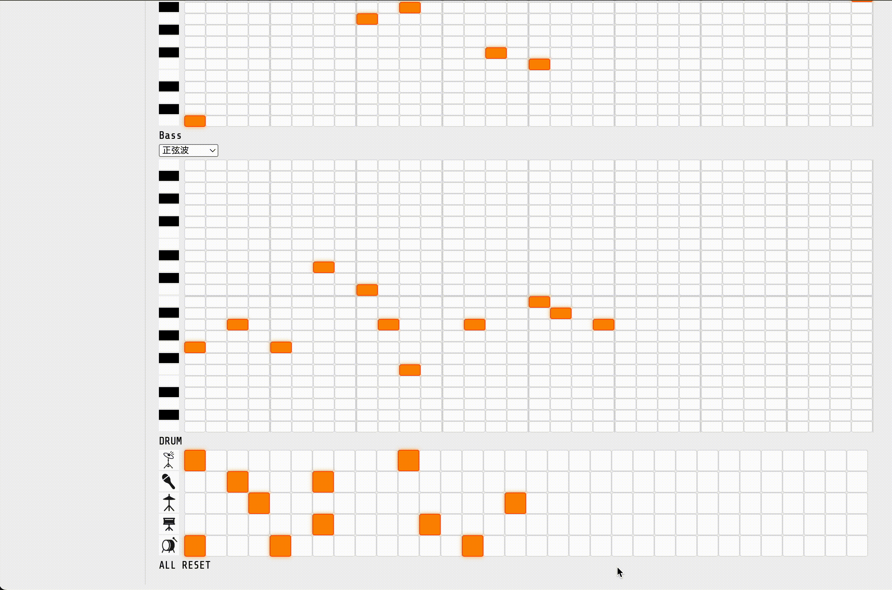
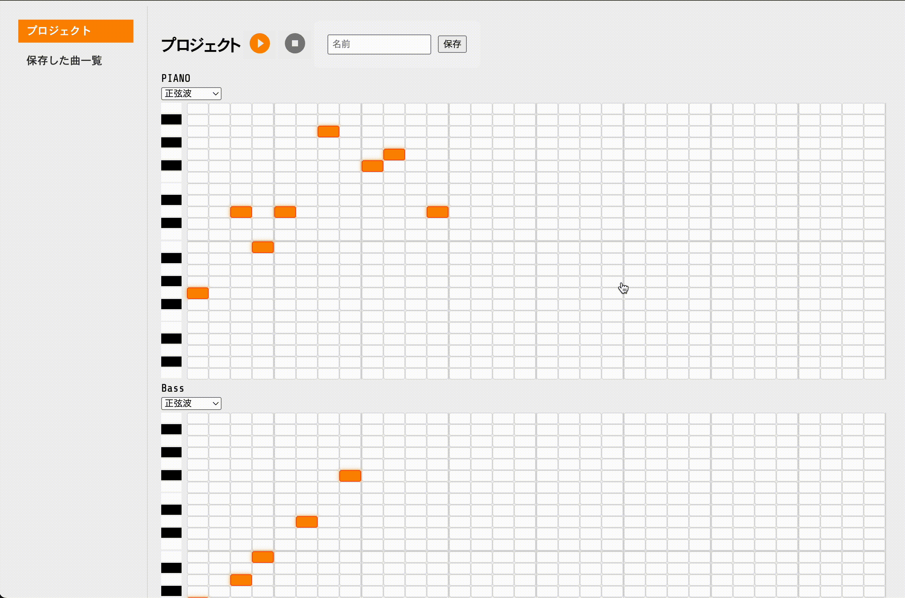
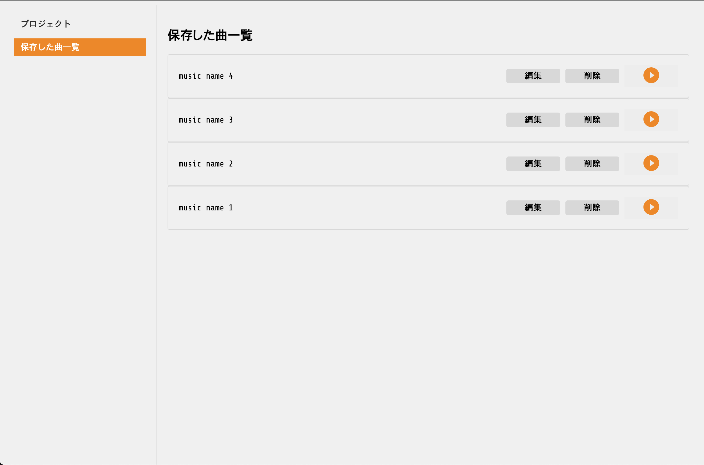
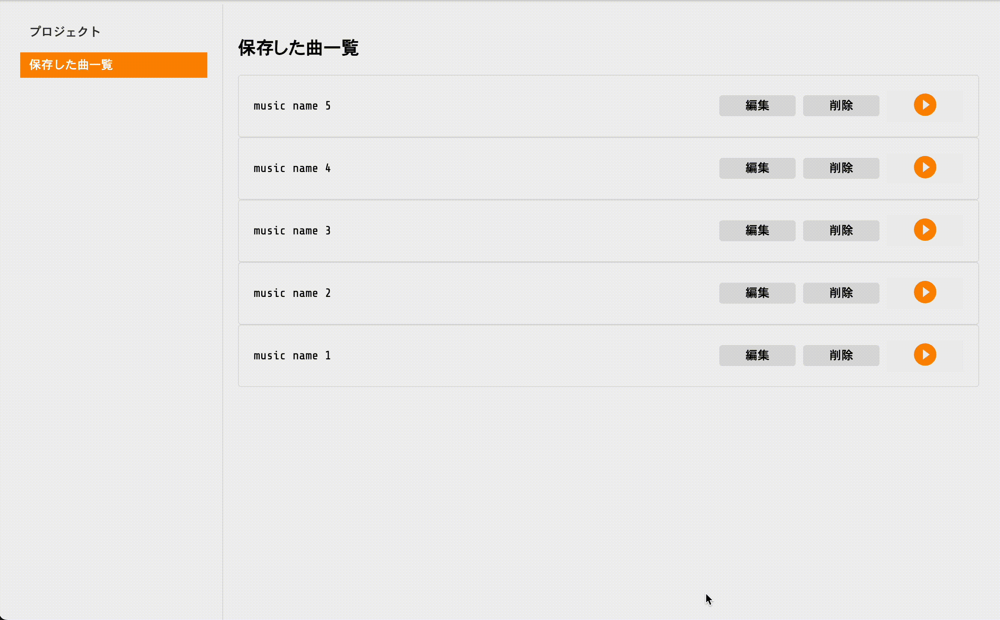
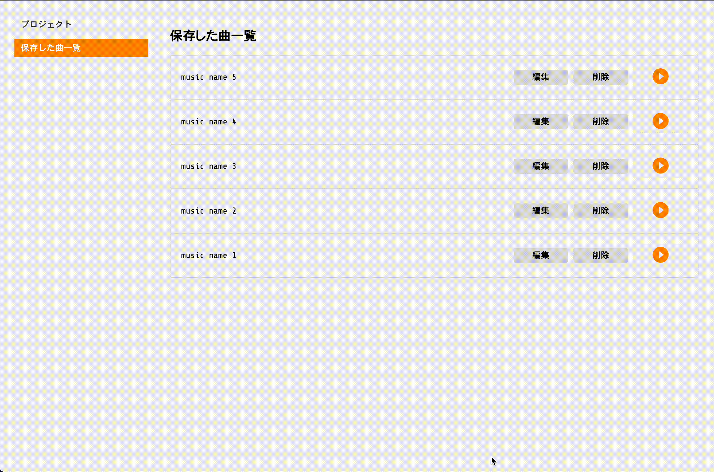

# DAW (音楽制作ソフト)

## 概要
ドラム・ベース・シンセを使って、2小節のパターンを打ち込みで作曲できるDAW（Digiドラムはキック、スネア、ハイハット、シェイカー、クラッシュの5つの音色のみtal Audio Workstation）ソフト

一般的なDAWは多機能で便利な反面、操作方法
など覚えることが多く、使い始めたばかりの頃は完成までのハードルが高くなりがちです。
そこで今回は、楽器数や機能をあえて絞ることで、初心者でも作曲の楽しさを最大限に引き出せるように作りました。

## 技術構成

### バックエンド（`api` ディレクトリ）

- Python 3.10
- FastAPI（APIフレームワーク）
  - API 側は CRUD 操作のみのシンプルな実装なため、小規模向けのフレームワークとして選定
- Uvicorn（ASGIサーバー）
- pytest（ユニットテスト）
- Flake8（リンター）
- Black（コードフォーマッタ）

### フロントエンド（`gui` ディレクトリ）
- TypeScript
- Vue 3
  - 業務での使用経験もありフレームワークの中で一番得意であるため選定
- Tone.js（音源生成ライブラリ）
  - 音源の生成や再生で使用
- Vite（ビルドツール）
- Vitest（ユニットテスト）
- Vue-Test-Utils （コンポーネントテスト）
- ESLint (リンター)
- Prettier（コードフォーマッタ）

### 画像・音源について
- 画像
  - 基本的には Iconify（アイコンライブラリ）を使用
    - ドラムのアイコン画像のみ Iconify になかったため ChatGPT で生成
- 音源
  - ベース・シンセ
    - Tone.js
  - ドラム
    - Serum (ソフトシンセ) を使用して自作
      - 自分で作れば著作権を気にしなくて良いため

## 機能一覧
### 楽曲制作画面
打ち込み画面。2小節、2オクターブのグリッドを設置。



ドラムはキック、スネア、ハイハット、シェイカー、クラッシュの5つの音色



打ち込み


GIF だと音声がないため別途 mp4 で動画も添付します

音声あり動画は [こちら](docs/daw-3.mp4)

打ち込み後



打ち込んだデータを途中で再生可能。

音声あり動画は [こちら](docs/daw-6.mp4)

シンセ・ベースは波形の変更が可能(4種類)。

音声あり動画は [こちら](docs/daw-7.mp4)

気に入らなかったら打ち込んだデータをリセットできる

音声あり動画は [こちら](docs/daw-8.mp4)

名前などを設定して保存ボタンを押すと、APIを通じてデータを保存。その後一覧画面で確認可能

音声あり動画は [こちら](docs/daw-9.mp4)

### 制作した楽曲一覧画面

これまで制作した楽曲を再生することができる


音声あり動画は [こちら](docs/daw-11.mp4)

楽曲の削除や、編集ボタンを押して制作画面に戻ることができる

音声あり動画は [こちら](docs/daw-12.mp4)

## 起動方法

### バックエンド（APIサーバー）の起動

api ディレクトリで：
```bash
PYTHONPATH=.. uvicorn main:app --reload
```

### フロントエンド（GUI）の起動
プロジェクトルートで：

gui ディレクトリで：

```bash
npm install
npm run dev
```